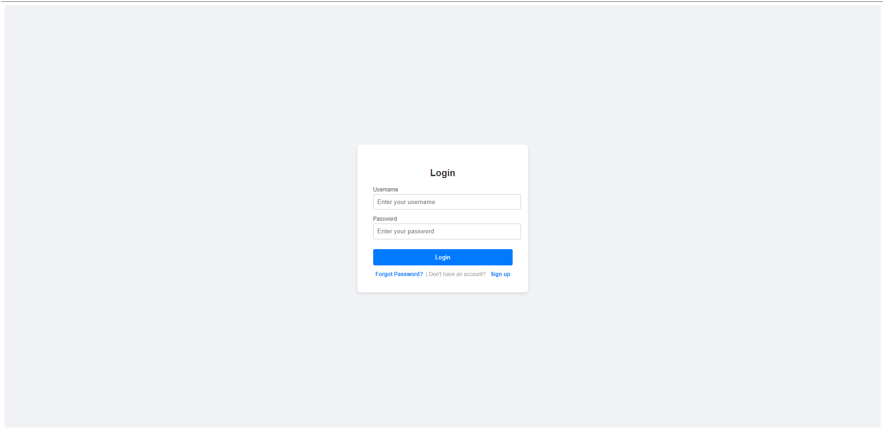
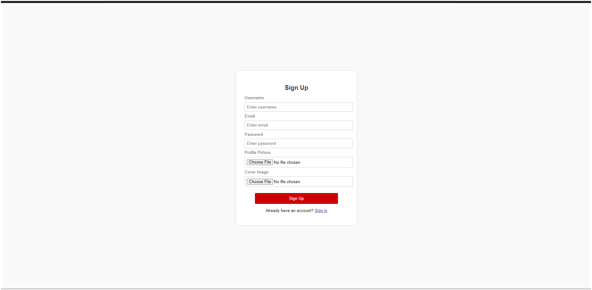
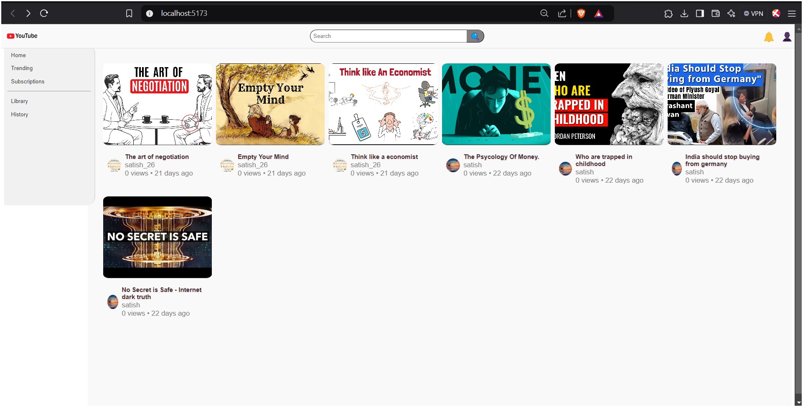
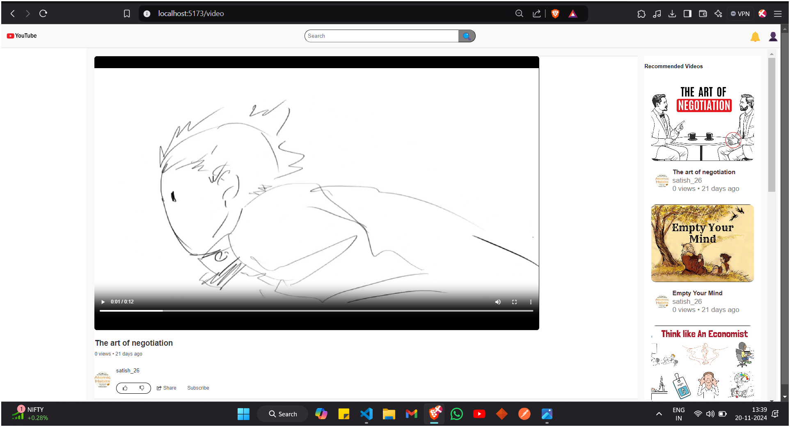

# EduPlay Backend 🚀

Welcome to the **EduPlay** backend repository! EduPlay is a next-gen video streaming platform designed to provide an engaging blend of educational and entertaining content. This backend supports all server-side logic, user management, and media operations for the EduPlay platform.

---

## 🌟 Table of Contents

- [About EduPlay](#about-eduplay)
- [Tech Stack](#tech-stack)
- [Run Locally](#run-locally)
- [Core Features](#core-features)
- [API Overview](#api-overview)
- [Contributing](#contributing)
- [License](#license)

---

## 📖 About EduPlay

**EduPlay** is more than just a video platform; it’s a comprehensive learning environment designed to make education entertaining. Our platform combines a vast range of subjects and themes to offer interactive, insightful, and fun learning experiences for all ages. With a simple and intuitive UI and rich content tailored to different learning styles, EduPlay empowers users to learn, explore, and grow.

---

## ⚙️ Tech Stack

EduPlay backend is built with a robust stack to ensure scalability, reliability, and high performance:

- **Backend Framework:** Node.js, Express.js
- **Database:** MongoDB
- **Authentication:** JWT (JSON Web Tokens)
- **Storage:** Cloudinary for media files
- **Testing:** Postman
- **API Documentation:** Swagger

---

## 🚀 Run Locally

To get a local copy of EduPlay up and running, follow these steps:

### Prerequisites

- **Node.js** (v20 @latest)
- **MongoDB** Cloud Instance
- **Cloudinary Setup** (for Media storage)
- **Git** (to clone this repository)

### Installation

1. **Clone the repository:**
   ```bash
   git clone https://github.com/Satishg2606/EduPlay-Backend.git
   cd eduplay-backend
### Demo Images 






